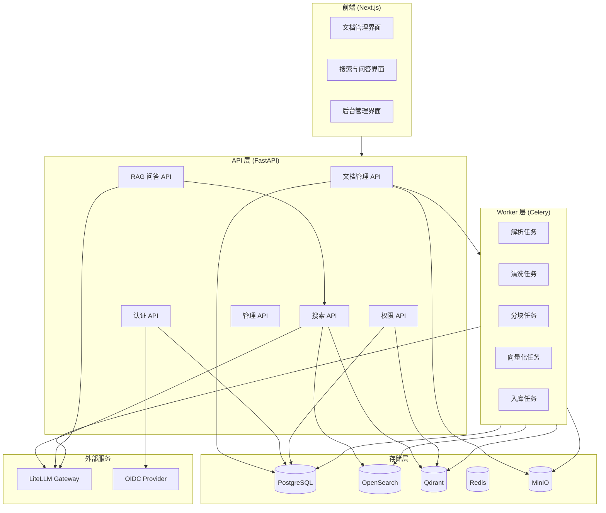
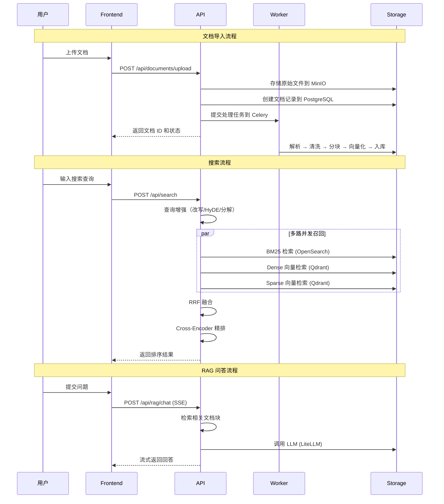
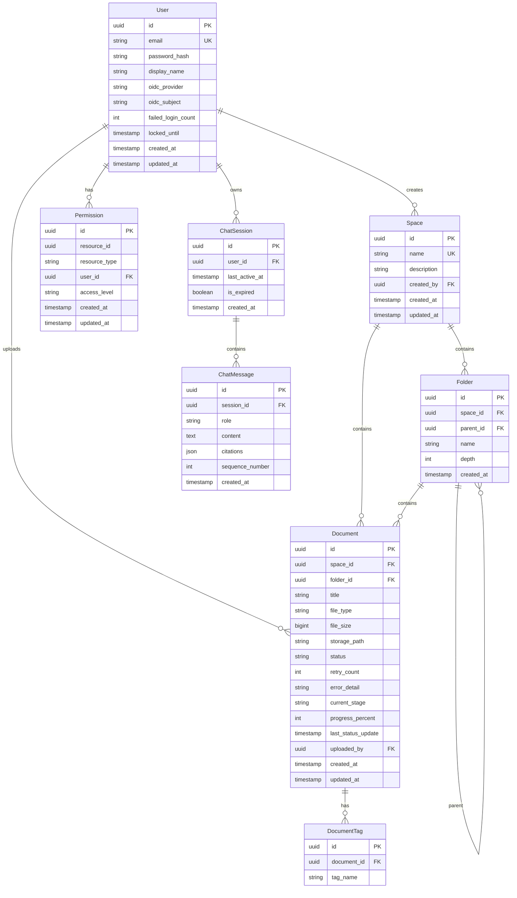
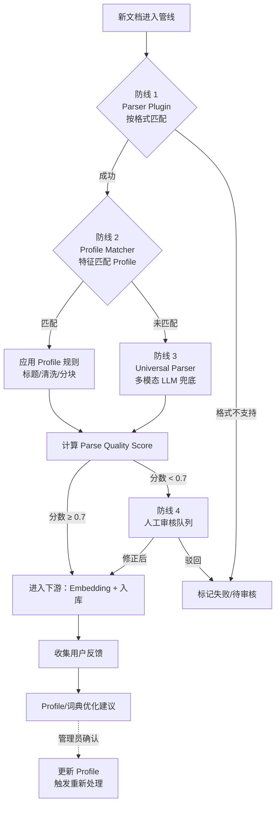
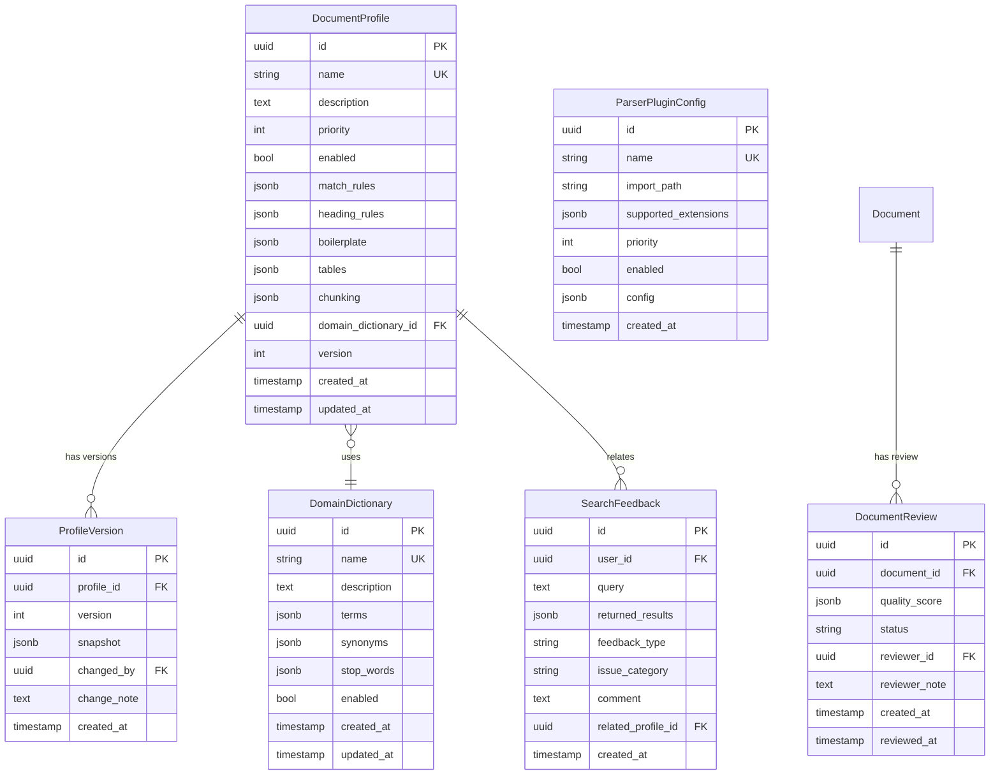

# 技术设计文档

## 概述

Wikforge 是一个企业级知识库系统，采用微服务架构，通过 Docker Compose 编排部署。系统核心能力包括：

1. **文档导入与处理**：支持多格式文档导入，通过 Celery 异步管线完成解析、清洗、分块、向量化
2. **可扩展解析架构**：Profile 驱动 + LLM 兜底 + 插件化扩展，新文档类型通过配置即可适配，无需修改代码
3. **复合搜索**：多路召回（BM25 + Dense + Sparse）+ RRF 融合 + Cross-Encoder 精排
4. **RAG 问答**：基于检索增强生成的对话式问答，支持多轮对话和流式输出
5. **认证与权限**：本地账号 + OIDC 认证，ABAC 权限模型，搜索时 Pre-Filtering
6. **反馈闭环**：质量评分 + 人工审核 + 用户反馈，Profile 和词典持续迭代
7. **前端界面**：Next.js + Tailwind CSS + shadcn/ui，包含文档管理、搜索问答、后台管理

### 技术栈

| 层级 | 技术选型 |
|------|----------|
| 后端框架 | Python (FastAPI) |
| 异步任务 | Celery + Redis (Broker) |
| 关系数据库 | PostgreSQL |
| 全文搜索 | OpenSearch |
| 向量数据库 | Qdrant |
| 缓存/消息 | Redis |
| 对象存储 | MinIO |
| LLM 网关 | LiteLLM |
| 前端框架 | Next.js + Tailwind CSS + shadcn/ui |
| 容器编排 | Docker Compose |

### 设计决策

1. **FastAPI 作为后端框架**：原生异步支持，自动 OpenAPI 文档生成，类型安全，适合 I/O 密集型知识库场景
2. **Celery 异步管线**：成熟的分布式任务队列，支持任务链、重试、优先级，适合文档处理流水线
3. **Qdrant 作为向量数据库**：原生支持 Dense + Sparse 向量混合检索，payload 过滤性能优秀，适合 ABAC Pre-Filtering
4. **OpenSearch 全文检索**：BM25 算法成熟，支持中文分词（IK 分词器），高亮功能完善
5. **LiteLLM 统一网关**：一套接口对接 OpenAI、Claude、通义千问、Ollama，降低多模型集成复杂度
6. **RRF 融合算法**：无需训练，参数简单（k=60），对不同召回路的分数分布不敏感
7. **Profile 驱动 + 四层兜底架构**：解析策略从"代码驱动"转为"配置驱动 + LLM 兜底"，新文档类型通过配置新 Profile 即可适配，极端情况下通过多模态 LLM 兜底，避免每新增文档类型都要二次开发
8. **插件化扩展**：Parser/Cleaner/Chunker 以插件形式注册，支持热加载，便于扩展全新格式
9. **反馈闭环迭代**：质量评分 + 人工审核 + 用户反馈三级机制，收集的错误样本用于持续优化 Profile 和领域词典

## 架构

### 系统架构图



### 请求流程



## 组件与接口

### 1. 文档管理服务 (Document Service)

**职责**：文档上传、组织、状态管理

```python
# API 接口
POST   /api/documents/upload          # 上传文档（支持多文件）
POST   /api/documents/import-url      # URL 导入
GET    /api/documents                  # 文档列表（分页、筛选）
GET    /api/documents/{id}             # 文档详情
DELETE /api/documents/{id}             # 删除文档
PATCH  /api/documents/{id}/move       # 移动文档
POST   /api/documents/{id}/retry      # 重试处理

# 空间与目录
POST   /api/spaces                     # 创建空间
GET    /api/spaces                     # 空间列表
PUT    /api/spaces/{id}                # 编辑空间
DELETE /api/spaces/{id}                # 删除空间
POST   /api/spaces/{id}/folders        # 创建目录
GET    /api/spaces/{id}/tree           # 目录树
DELETE /api/folders/{id}               # 删除目录

# 标签
POST   /api/documents/{id}/tags        # 添加标签
DELETE /api/documents/{id}/tags/{tag}   # 删除标签
GET    /api/tags                        # 标签列表
```

### 2. 处理管线服务 (Pipeline Service)

**职责**：异步文档处理流水线

```python
# Celery 任务链
class PipelineOrchestrator:
    def process_document(self, document_id: str) -> None:
        """编排文档处理任务链"""
        chain = (
            parse_document.s(document_id) |
            clean_document.s() |
            chunk_document.s() |
            embed_chunks.s() |
            index_chunks.s()
        )
        chain.apply_async()

# 各步骤任务接口
@celery_app.task(bind=True, max_retries=3, default_retry_delay=10)
def parse_document(self, document_id: str) -> dict: ...

@celery_app.task(bind=True, max_retries=3)
def clean_document(self, parse_result: dict) -> dict: ...

@celery_app.task(bind=True, max_retries=3)
def chunk_document(self, clean_result: dict) -> dict: ...

@celery_app.task(bind=True, max_retries=3)
def embed_chunks(self, chunk_result: dict) -> dict: ...

@celery_app.task(bind=True, max_retries=3)
def index_chunks(self, embed_result: dict) -> None: ...
```

### 3. 搜索服务 (Search Service)

**职责**：多路召回、融合排序、精排

```python
# API 接口
POST /api/search                       # 复合搜索
POST /api/search/suggest               # 搜索建议

# 核心接口
class SearchService:
    async def search(self, query: SearchQuery, user: User) -> SearchResult:
        """执行复合搜索"""
        # 1. 查询增强
        enhanced = await self.enhance_query(query)
        # 2. 多路并发召回
        recalls = await asyncio.gather(
            self.bm25_recall(enhanced, user),
            self.dense_recall(enhanced, user),
            self.sparse_recall(enhanced, user),
            return_exceptions=True
        )
        # 3. RRF 融合
        candidates = self.rrf_fusion(recalls, k=60)
        # 4. Cross-Encoder 精排
        results = await self.rerank(candidates[:20])
        return results

class QueryEnhancer:
    async def enhance(self, query: str) -> EnhancedQuery:
        """查询增强：改写 + HyDE + 子查询分解"""
        ...
```

### 4. RAG 引擎 (RAG Engine)

**职责**：对话式问答，流式输出

```python
# API 接口
POST /api/rag/chat                     # 对话问答（SSE 流式）
GET  /api/rag/sessions                 # 会话列表
GET  /api/rag/sessions/{id}/history    # 会话历史

# 核心接口
class RAGEngine:
    async def chat(
        self, 
        question: str, 
        session_id: str,
        config: RAGConfig
    ) -> AsyncGenerator[str, None]:
        """流式 RAG 问答"""
        # 1. 检索相关文档块
        chunks = await self.search_service.search(question, top_k=config.top_k)
        # 2. 构建 prompt（含对话历史 + 检索上下文）
        prompt = self.build_prompt(question, chunks, session_id)
        # 3. 流式调用 LLM
        async for token in self.llm_gateway.stream(prompt):
            yield token
```

### 5. 认证服务 (Auth Service)

**职责**：用户认证、JWT 管理

```python
# API 接口
POST /api/auth/register                # 本地注册
POST /api/auth/login                   # 本地登录
POST /api/auth/refresh                 # 刷新 Token
POST /api/auth/logout                  # 登出
GET  /api/auth/oidc/authorize          # OIDC 授权跳转
GET  /api/auth/oidc/callback           # OIDC 回调

# 核心接口
class AuthService:
    async def register(self, email: str, password: str) -> User: ...
    async def login(self, email: str, password: str) -> TokenPair: ...
    async def refresh_token(self, refresh_token: str) -> TokenPair: ...
    async def verify_token(self, access_token: str) -> User: ...
```

### 6. 权限服务 (Permission Service)

**职责**：ABAC 权限判定、权限同步

```python
# API 接口
GET    /api/permissions/spaces/{id}           # 查询空间权限
PUT    /api/permissions/spaces/{id}           # 设置空间权限
GET    /api/permissions/documents/{id}        # 查询文档权限
PUT    /api/permissions/documents/{id}        # 设置文档权限
GET    /api/permissions/users/{id}/effective  # 用户有效权限

# 核心接口
class PermissionService:
    async def check_access(
        self, user: User, resource: Resource, action: Action
    ) -> bool:
        """ABAC 权限判定（<50ms）"""
        ...

    async def sync_to_qdrant(
        self, resource_id: str, permissions: list[Permission]
    ) -> None:
        """同步权限元数据到 Qdrant payload"""
        ...
```

## 数据模型

### PostgreSQL 数据模型



### Qdrant 向量数据模型

```python
# Collection: document_chunks
{
    "id": "uuid",                          # Chunk 唯一标识
    "vector": {
        "dense": [float] * 1024,           # Dense 向量 (1024维)
        "sparse": {                         # Sparse 向量 (SPLADE)
            "indices": [int],
            "values": [float]
        }
    },
    "payload": {
        "document_id": "uuid",             # 所属文档 ID
        "space_id": "uuid",                # 所属空间 ID
        "chunk_index": int,                # 块在文档中的位置索引
        "title_chain": "H1 > H2 > H3",    # 标题链
        "source_file": "filename.pdf",     # 原始文件名
        "page_number": int,                # 起始页码
        "content": "chunk text...",        # 块文本内容
        "parent_chunk_id": "uuid|null",    # 父块 ID（层级关系）
        "depth": int,                      # 层级深度 (1-6)
        "token_count": int,                # Token 数量
        # 权限字段（Pre-Filtering 用）
        "allowed_user_ids": ["uuid"],      # 允许访问的用户 ID 列表
        "access_level": "read|write",      # 访问级别
    }
}
```

### OpenSearch 索引模型

```json
{
    "mappings": {
        "properties": {
            "chunk_id": { "type": "keyword" },
            "document_id": { "type": "keyword" },
            "space_id": { "type": "keyword" },
            "content": {
                "type": "text",
                "analyzer": "ik_max_word",
                "search_analyzer": "ik_smart"
            },
            "title_chain": { "type": "text", "analyzer": "ik_max_word" },
            "source_file": { "type": "keyword" },
            "page_number": { "type": "integer" },
            "chunk_index": { "type": "integer" },
            "allowed_user_ids": { "type": "keyword" },
            "created_at": { "type": "date" }
        }
    }
}
```

### Redis 数据结构

```
# 文档处理状态缓存
doc:status:{document_id} -> Hash {
    stage: "parsing|cleaning|chunking|embedding|indexing|done|failed",
    progress: 0-100,
    updated_at: timestamp
}
TTL: 3600s

# 用户会话
session:{session_id} -> Hash {
    user_id: uuid,
    messages: JSON array (最近20轮),
    last_active: timestamp
}
TTL: 1800s (30分钟)

# 账号锁定
auth:lockout:{email} -> Hash {
    attempts: int,
    locked_until: timestamp
}
TTL: 900s (15分钟)

# 权限缓存
perm:user:{user_id}:space:{space_id} -> string (access_level)
TTL: 300s (5分钟)
```


## 可扩展解析架构（四层兜底）

### 整体思路

新文档类型进入系统时，按以下顺序尝试解析，失败才降级到下一层：



### 1. Parser Plugin（格式插件层）

**职责**：按文件格式把原始文件转为结构化的中间表示（IR，Intermediate Representation），不处理业务结构理解。

```python
from typing import Protocol

class ParserPlugin(Protocol):
    """解析器插件协议"""
    name: str
    supported_extensions: list[str]
    priority: int

    def can_parse(self, file_path: str, mime_type: str) -> bool:
        """判断是否能处理该文件"""
        ...

    async def parse(self, file_path: str) -> ParsedDocument:
        """解析文件，返回中间表示"""
        ...


@dataclass
class ParsedDocument:
    """解析器输出的中间表示"""
    blocks: list[Block]            # 结构化块序列
    metadata: dict                 # 文件元数据（页数、作者等）
    assets: list[Asset]            # 附件（图片、公式截图）

@dataclass
class Block:
    """最小粒度的内容单元"""
    type: str                      # "paragraph" | "heading" | "table" | "image" | "formula" | "list"
    text: str
    bbox: tuple[float, float, float, float] | None  # 位置信息（用于统计噪声）
    page_number: int
    style: dict                    # 字号、粗体、斜体等
    raw: dict                      # 原始解析数据（调试用）


class ParserRegistry:
    """插件注册表，支持热加载"""
    _plugins: list[ParserPlugin] = []

    def register(self, plugin: ParserPlugin) -> None: ...
    def unregister(self, name: str) -> None: ...
    def select(self, file_path: str, mime_type: str) -> ParserPlugin:
        """按 priority 和 can_parse 选择插件"""
        ...
    def reload(self) -> None:
        """从配置文件重新加载插件"""
        ...
```

**预置插件**：PDF（Marker）、DOCX（python-docx）、PPTX（python-pptx）、HTML（trafilatura）、Markdown、Plain Text。

### 2. Profile Matcher（档案匹配层）

**职责**：根据文档特征自动匹配 Document Profile，Profile 定义了标题识别、噪声去除、分块策略等配置。

```python
@dataclass
class DocumentProfile:
    id: str
    name: str                              # "中式技术规范"
    description: str
    priority: int                          # 优先级（同时匹配时取最高）
    enabled: bool

    # 匹配规则（任一命中即认为匹配）
    match_rules: MatchRules

    # 标题识别规则
    heading_rules: list[HeadingRule]

    # 噪声模式
    boilerplate: BoilerplateConfig

    # 表格处理
    tables: TableConfig

    # 分块参数
    chunking: ChunkingConfig

    # 关联领域词典
    domain_dictionary_id: str | None

    # 元数据
    created_at: datetime
    updated_at: datetime
    version: int                           # 版本号，每次修改递增

@dataclass
class MatchRules:
    filename_regex: list[str] = []
    content_regex: list[str] = []          # 匹配前 N 页文本
    min_content_match_count: int = 1       # 至少几条 content_regex 命中

@dataclass
class HeadingRule:
    pattern: str                           # 正则
    level: int                             # 层级（1-6）
    strip_pattern: bool = False            # 是否去除编号保留标题文字

@dataclass
class BoilerplateConfig:
    detection_mode: str                    # "statistical" | "manual" | "both"
    statistical_threshold: float = 0.5     # 同位置同文本出现频率阈值
    manual_patterns: list[str] = []        # 手动配置的正则

@dataclass
class TableConfig:
    cross_page_merge: bool = True
    row_level_chunking: bool = False       # 大表格是否按行分块
    collapse_merged_cells: str = "describe" # "describe" | "repeat"

@dataclass
class ChunkingConfig:
    min_tokens: int = 256
    max_tokens: int = 800
    overlap_tokens: int = 80
    respect_heading_level: int = 1         # 不跨越该级标题切分
    protect_patterns: list[str] = []       # 原子单元（数值、公式）


class ProfileMatcher:
    async def match(self, parsed_doc: ParsedDocument, filename: str) -> DocumentProfile:
        """
        1. 提取文档特征（前 N 页内容 + 文件名 + 结构特征）
        2. 遍历所有启用的 Profile，尝试匹配
        3. 返回优先级最高的匹配结果；无匹配返回默认 Profile
        """
        ...

    async def extract_features(self, parsed_doc: ParsedDocument) -> DocumentFeatures:
        """特征提取（用于 Profile 匹配 + 候选 Profile 生成）"""
        ...
```

**预置 Profile**：
- `generic-text`：通用文本文档（默认兜底）
- `chinese-technical-spec`：中式技术规范（一/二/三、(一)/(二)、1/(1)/① 编号）
- `scanned-pdf`：扫描版 PDF（强制走 OCR + LLM）

Profile 存储在 PostgreSQL，支持通过管理界面 CRUD，支持 JSON 导入/导出。

### 3. Universal Parser（LLM 兜底层）

**职责**：无 Profile 匹配或质量分过低时，用多模态 LLM 理解文档结构。

```python
class UniversalParser:
    def __init__(self, llm_gateway: LLMGateway, model: str = "gpt-4o"):
        self.llm = llm_gateway
        self.model = model

    async def parse(self, parsed_doc: ParsedDocument) -> StructuredDocument:
        """
        按页调用多模态 LLM：
        - 输入：页面图像（从 PDF/Office 导出）+ 原始文本块
        - 输出：结构化 Markdown + 识别到的标题层级 + 噪声模式
        """
        ...

    async def suggest_profile(self, structured: StructuredDocument) -> DocumentProfile:
        """
        基于解析结果生成候选 Profile：
        - 提取标题正则
        - 提取噪声模式
        - 推荐分块参数
        返回的 Profile 进入"待审核"状态，管理员确认后保存
        """
        ...
```

**降级策略**：Universal Parser 失败时，回退到"仅提取纯文本 + 固定大小分块"的最基础方案，保证文档至少能被检索。

### 4. Quality Score + Review Queue（审核层）

**职责**：量化评估解析质量，低质量文档进入审核队列。

```python
@dataclass
class ParseQualityScore:
    overall: float                         # 综合分 0-1
    components: dict                       # {
                                           #   "text_retention": 0.95,
                                           #   "heading_detection": 0.80,
                                           #   "table_completeness": 0.70,
                                           #   "numeric_protection": 1.0,
                                           #   "boilerplate_removal": 0.90
                                           # }
    issues: list[str]                      # 检测到的具体问题

class QualityScorer:
    def score(
        self,
        original: ParsedDocument,
        processed: StructuredDocument,
        profile: DocumentProfile,
    ) -> ParseQualityScore:
        """计算多维度质量分"""
        ...

class ReviewQueue:
    async def enqueue(self, document_id: str, score: ParseQualityScore) -> None: ...
    async def list_pending(self, filters: ReviewFilters) -> list[ReviewItem]: ...
    async def approve(self, review_id: str, corrections: StructuredDocument) -> None:
        """管理员修正后触发重新分块/向量化/入库"""
        ...
```

### 5. Feedback Loop（反馈迭代层）

**职责**：收集用户反馈，分析错误模式，生成 Profile 优化建议。

```python
@dataclass
class SearchFeedback:
    id: uuid
    user_id: uuid
    query: str
    returned_results: list[str]            # chunk_id 列表
    feedback_type: str                     # "thumbs_up" | "thumbs_down" | "issue"
    issue_category: str | None             # "irrelevant" | "missing_info" | "citation_error" | "format" | "other"
    comment: str | None
    related_profile_id: str | None
    created_at: datetime

class FeedbackAnalyzer:
    async def aggregate(self, filter: FeedbackFilter) -> FeedbackReport:
        """按 Profile / 文档 / 查询类型聚合反馈"""
        ...

    async def detect_patterns(self) -> list[OptimizationSuggestion]:
        """
        识别错误模式：
        - 某 Profile 下相同错误重复出现 → 建议调整 Profile
        - 某领域术语频繁被拆错 → 建议加入词典
        - 某类查询长期低相关 → 建议查询改写模板
        """
        ...

@dataclass
class OptimizationSuggestion:
    type: str                              # "adjust_chunking" | "add_term" | "update_boilerplate" | ...
    target: str                            # Profile ID 或 Dictionary ID
    recommendation: dict                   # 具体建议内容
    evidence: list[str]                    # 支持证据（反馈 ID 列表）
    confidence: float
```

### 6. Domain Dictionary（领域词典）

**职责**：管理行业术语，同步到 OpenSearch IK 分词器。

```python
@dataclass
class DomainDictionary:
    id: str
    name: str                              # "水泥行业术语"
    description: str
    terms: list[Term]
    synonyms: list[SynonymGroup]
    stop_words: list[str]
    enabled: bool

@dataclass
class Term:
    word: str
    pos: str | None                        # 词性（可选）
    weight: float = 1.0

@dataclass
class SynonymGroup:
    primary: str
    synonyms: list[str]                    # 如 ["大齿圈", "齿圈", "主齿圈"]

class DictionaryService:
    async def upsert(self, dictionary: DomainDictionary) -> None: ...
    async def sync_to_opensearch(self, dictionary_id: str) -> None:
        """同步到 IK 分词器的远程词库 URL（热更新）"""
        ...
    async def suggest_terms(self, sample_limit: int = 100) -> list[str]:
        """从反馈和文档中抽取候选术语"""
        ...
```

### 7. 增强后的处理管线

原管线（解析 → 清洗 → 分块 → 向量化 → 入库）增强为：

```python
class EnhancedPipelineOrchestrator:
    async def process_document(self, document_id: str) -> None:
        # 1. 原始解析（Parser Plugin）
        parsed = await self.parser_registry.select(file_path).parse(file_path)

        # 2. Profile 匹配
        profile = await self.profile_matcher.match(parsed, filename)

        # 3. 应用 Profile 处理（清洗 + 结构识别）
        try:
            structured = await self.structural_processor.process(parsed, profile)
            score = self.quality_scorer.score(parsed, structured, profile)
        except Exception:
            score = ParseQualityScore(overall=0.0, ...)
            structured = None

        # 4. 质量判断 + LLM 兜底
        if score.overall < settings.QUALITY_FALLBACK_THRESHOLD:
            structured = await self.universal_parser.parse(parsed)
            score = self.quality_scorer.score(parsed, structured, profile)

            # 生成候选 Profile，推荐给管理员
            candidate = await self.universal_parser.suggest_profile(structured)
            await self.profile_service.save_candidate(candidate)

        # 5. 质量门禁
        if score.overall < settings.REVIEW_QUEUE_THRESHOLD:
            await self.review_queue.enqueue(document_id, score)
            return  # 等待管理员审核后再继续

        # 6. 分块 + 向量化 + 入库（使用 Profile 中的参数）
        chunks = await self.chunker.chunk(structured, profile.chunking)
        await self.embedder.embed(chunks)
        await self.indexer.index(chunks)
```

### 8. PostgreSQL 新增数据模型



### 9. 管理 UI 新增部分

- **Profile 管理页**：列表、新增、编辑、启用/禁用、版本历史、JSON 导入导出
- **Profile 编辑器**：可视化规则编辑（标题规则表格、噪声正则列表、分块参数）+ 实时预览（上传样本文档查看解析效果）
- **审核队列页**：待审核文档列表（按质量分排序）、原文对比视图、修正编辑器
- **反馈分析页**：反馈聚合图表（按 Profile / 文档 / 时间）、错误模式列表、优化建议
- **词典管理页**：术语增删改、同义词组管理、CSV 导入、候选术语审核
- **插件管理页**：已注册插件列表、启用/禁用、优先级调整、重载按钮

## 扩展性保证

这套架构保证新文档类型 **95% 场景不需要改代码**：

| 场景 | 处理路径 | 开发成本 |
|------|---------|----------|
| 格式已支持、结构相似 | 命中已有 Profile | 零 |
| 格式已支持、结构新颖 | 管理员创建新 Profile | 零（纯配置） |
| 格式已支持、未知结构 | LLM 兜底 + 候选 Profile 推荐 | 零 |
| 格式已支持、质量不达标 | 审核队列 + 人工修正 | 零 |
| 全新文件格式（如 CAD） | 开发新 Parser Plugin | 插件级开发（罕见） |

