# 实现任务列表

> 任务依赖关系参见下方 Mermaid 图。原 ID 与新 ID 的映射记录在每个任务的描述中（如原 Task 7B → 任务 8）。

## 任务依赖图

```mermaid
graph TD
    T1[任务 1: 项目骨架与 Docker Compose] --> T2[任务 2: 数据库模型与迁移]
    T1 --> T3[任务 3: 认证服务]
    T2 --> T3
    T2 --> T4[任务 4: 权限服务]
    T3 --> T4
    T2 --> T5[任务 5: 文档管理 - 空间与目录]
    T4 --> T5
    T5 --> T6[任务 6: 文档管理 - 上传与存储]
    T6 --> T7[任务 7: 解析器插件系统与原生解析器]
    T7 --> T8[任务 8: Profile 系统与特征匹配]
    T8 --> T9[任务 9: 文档处理管线 - 清洗与分块]
    T9 --> T10[任务 10: LLM 通用解析兜底]
    T10 --> T11[任务 11: 解析质量评分与审核队列]
    T11 --> T12[任务 12: 文档处理管线 - 向量化与入库]
    T12 --> T13[任务 13: 领域词典管理]
    T12 --> T14[任务 14: 复合搜索引擎]
    T13 --> T14
    T14 --> T15[任务 15: 查询增强]
    T14 --> T16[任务 16: RAG 对话引擎]
    T15 --> T16
    T16 --> T17[任务 17: 检索反馈与迭代分析]
    T1 --> T18[任务 18: 前端项目初始化]
    T3 --> T19[任务 19: 前端 - 认证页面]
    T18 --> T19
    T5 --> T20[任务 20: 前端 - 文档管理界面]
    T18 --> T20
    T19 --> T20
    T14 --> T21[任务 21: 前端 - 搜索与问答界面]
    T18 --> T21
    T19 --> T21
    T4 --> T22[任务 22: 前端 - 后台管理界面]
    T18 --> T22
    T19 --> T22
    T8 --> T23[任务 23: 前端 - Profile 与审核管理]
    T11 --> T23
    T22 --> T23
    T13 --> T24[任务 24: 前端 - 词典与反馈分析]
    T17 --> T24
    T22 --> T24
    T16 --> T25[任务 25: 集成测试与检索质量评估]
    T24 --> T25
```

- [x] 1. 项目骨架与 Docker Compose
  - 搭建后端 FastAPI 项目结构、Docker Compose 编排、Celery 配置，确保 docker compose up 能启动全部服务。
  - _Requirements: 14_
  - _Design: 架构概述、Docker Compose 配置_
  - [x] 1.1 创建后端项目结构（backend/）：FastAPI 应用入口、配置管理、目录分层（api/、services/、models/、tasks/、core/）
  - [x] 1.2 创建 Docker Compose 配置文件，包含 8 个服务：postgres、opensearch、qdrant、redis、minio、api、worker、frontend
  - [x] 1.3 配置各服务的健康检查（间隔 30s、超时 60s、重试 3 次）和 depends_on 依赖关系
  - [x] 1.4 创建 .env.example 文件，列出所有可配置参数（端口、密码、API Key 等）
  - [x] 1.5 配置数据卷持久化（postgres_data、opensearch_data、qdrant_data、minio_data）
  - [x] 1.6 创建后端 Dockerfile（Python 3.11 + 依赖安装）
  - [x] 1.7 创建 pyproject.toml / requirements.txt，列出所有 Python 依赖
  - [x] 1.8 配置 FastAPI 应用基础结构：CORS、异常处理、日志、OpenAPI 文档
  - [x] 1.9 配置 Celery 应用：Redis Broker 连接、任务自动发现、重试策略
  - [x] 1.10 验证 docker compose up 能成功启动所有服务并通过健康检查

- [x] 2. 数据库模型与迁移
  - 完成 SQLAlchemy 模型与 Alembic 迁移，预置初始管理员与 3 个默认 Profile。
  - _Requirements: 1, 2, 3, 9, 10, 15, 16, 17, 18, 19, 20_
  - _Design: 数据模型（PostgreSQL ER 图 + 扩展数据模型）_
  - _Depends on: 1_
  - [x] 2.1 配置 SQLAlchemy 2.0 异步引擎（asyncpg）和 Session 管理
  - [x] 2.2 创建 User 模型（id、email、password_hash、display_name、oidc_provider、oidc_subject、failed_login_count、locked_until）
  - [x] 2.3 创建 Space 模型（id、name、description、created_by）
  - [x] 2.4 创建 Folder 模型（id、space_id、parent_id、name、depth）
  - [x] 2.5 创建 Document 模型（id、space_id、folder_id、title、file_type、file_size、storage_path、status、retry_count、error_detail、current_stage、progress_percent、matched_profile_id、quality_score）
  - [x] 2.6 创建 DocumentTag 模型（id、document_id、tag_name）
  - [x] 2.7 创建 Permission 模型（id、resource_id、resource_type、user_id、access_level）
  - [x] 2.8 创建 ChatSession 和 ChatMessage 模型
  - [x] 2.9 创建 DocumentProfile 模型（id、name、description、priority、enabled、match_rules、heading_rules、boilerplate、tables、chunking、domain_dictionary_id、version）
  - [x] 2.10 创建 ProfileVersion 模型（版本历史、snapshot、changed_by、change_note）
  - [x] 2.11 创建 DomainDictionary 模型（id、name、terms、synonyms、stop_words、enabled）
  - [x] 2.12 创建 ParserPluginConfig 模型（id、name、import_path、supported_extensions、priority、enabled、config）
  - [x] 2.13 创建 DocumentReview 模型（id、document_id、quality_score、status、reviewer_id、reviewer_note）
  - [x] 2.14 创建 SearchFeedback 模型（id、user_id、query、returned_results、feedback_type、issue_category、comment、related_profile_id）
  - [x] 2.15 配置 Alembic 迁移环境，生成初始迁移脚本
  - [x] 2.16 创建数据库初始化脚本（创建扩展、初始管理员账号、预置 3 个默认 Profile）

- [x] 3. 认证服务
  - 实现本地账号 + OIDC 登录、JWT 签发与刷新、登录失败锁定。
  - _Requirements: 9_
  - _Design: Auth Service 接口_
  - _Depends on: 1, 2_
  - [x] 3.1 实现本地注册接口 POST /api/auth/register（邮箱唯一校验、密码复杂度校验、bcrypt 哈希）
  - [x] 3.2 实现本地登录接口 POST /api/auth/login（密码验证、JWT 签发）
  - [x] 3.3 实现 JWT Token 签发逻辑（Access Token 30 分钟、Refresh Token 7 天）
  - [x] 3.4 实现 Token 刷新接口 POST /api/auth/refresh
  - [x] 3.5 实现登录失败锁定机制（Redis 计数器，30 分钟内 5 次失败锁定 15 分钟）
  - [x] 3.6 实现 OIDC 授权跳转接口 GET /api/auth/oidc/authorize（使用 authlib）
  - [x] 3.7 实现 OIDC 回调接口 GET /api/auth/oidc/callback（用户自动创建/绑定）
  - [x] 3.8 实现 JWT 验证中间件（FastAPI Depends 依赖注入）
  - [x] 3.9 编写认证服务单元测试（注册、登录、刷新、锁定、OIDC 流程）

- [x] 4. 权限服务
  - 实现基于 ABAC 的空间/文档级权限判定，权限元数据同步到 Qdrant payload。
  - _Requirements: 10_
  - _Design: Permission Service 接口、ABAC 模型_
  - _Depends on: 2, 3_
  - [x] 4.1 实现 ABAC 权限判定核心逻辑（check_access 方法，<50ms 响应）
  - [x] 4.2 实现空间级权限设置接口 PUT /api/permissions/spaces/{id}（不可见/只读/可写）
  - [x] 4.3 实现文档级权限设置接口 PUT /api/permissions/documents/{id}（覆盖空间权限）
  - [x] 4.4 实现权限继承逻辑（文档默认继承空间权限，文档级优先）
  - [x] 4.5 实现权限元数据同步到 Qdrant payload 的逻辑（3 秒内完成）
  - [x] 4.6 实现权限变更时异步更新 Qdrant 的 Celery 任务（60 秒内完成）
  - [x] 4.7 实现 Redis 权限缓存（TTL 5 分钟，权限变更时主动失效）
  - [x] 4.8 实现权限同步失败回滚机制
  - [x] 4.9 编写权限服务单元测试（ABAC 判定、继承、同步、回滚）

- [x] 5. 文档管理 - 空间与目录
  - 实现空间、目录、标签的 CRUD 与级联删除。
  - _Requirements: 2_
  - _Design: Document Service 接口_
  - _Depends on: 2, 4_
  - [x] 5.1 实现空间 CRUD 接口（POST/GET/PUT/DELETE /api/spaces）
  - [x] 5.2 实现空间名称唯一性校验（1-50 字符）
  - [x] 5.3 实现目录 CRUD 接口（POST/GET/DELETE /api/spaces/{id}/folders）
  - [x] 5.4 实现目录嵌套限制（最多 10 级）和同级唯一性校验
  - [x] 5.5 实现目录树查询接口 GET /api/spaces/{id}/tree
  - [x] 5.6 实现标签管理接口（添加/删除标签，1-20 个标签限制，1-30 字符限制）
  - [x] 5.7 实现文档筛选接口（按空间/目录/标签筛选，分页，每页 20 条）
  - [x] 5.8 实现文档移动接口 PATCH /api/documents/{id}/move
  - [x] 5.9 实现级联删除逻辑（删除空间/目录时级联删除子目录和文档）
  - [x] 5.10 编写空间与目录管理单元测试

- [x] 6. 文档管理 - 上传与存储
  - 文件上传到 MinIO、URL 导入、文档处理状态机、重试与永久失败。
  - _Requirements: 1, 3_
  - _Design: Document Service、MinIO 存储_
  - _Depends on: 5_
  - [x] 6.1 配置 MinIO 客户端（boto3 S3 兼容接口）
  - [x] 6.2 实现文件上传接口 POST /api/documents/upload（支持多文件，最多 50 个）
  - [x] 6.3 实现文件格式校验（PDF、DOCX、PPTX、TXT、MD、HTML）和大小校验（100MB 限制）
  - [x] 6.4 实现文件存储到 MinIO 并返回存储路径
  - [x] 6.5 实现 URL 导入接口 POST /api/documents/import-url（30 秒超时，trafilatura 抓取）
  - [x] 6.6 实现文档状态管理（状态机：待处理→解析中→清洗中→分块中→向量化中→已完成/失败）
  - [x] 6.7 实现文档处理进度查询接口（Redis 缓存进度信息，每 5 秒更新）
  - [x] 6.8 实现文档重试接口 POST /api/documents/{id}/retry（重置状态，重新入队）
  - [x] 6.9 实现永久失败标记逻辑（累计 3 次失败）
  - [x] 6.10 编写上传与状态管理单元测试

- [x] 7. 解析器插件系统与原生解析器
  - 定义插件协议、注册表与中间表示，实现 PDF/Word/PPT/HTML/MD 等原生解析器，搭建 Celery 任务链。
  - _Requirements: 1, 4, 19_
  - _Design: Parser Plugin（格式插件层）、ParserRegistry_
  - _Depends on: 6_
  - [x] 7.1 定义 ParserPlugin 接口协议(name、supported_extensions、priority、can_parse、parse)
  - [x] 7.2 定义中间表示数据结构(ParsedDocument、Block、Asset)
  - [x] 7.3 实现 ParserRegistry(注册、注销、选择、热加载)
  - [x] 7.4 实现插件配置加载(从 ParserPluginConfig 表读取，支持启用/禁用/优先级)
  - [x] 7.5 实现 PDF 解析器插件(Marker 库，提取文本、标题层级、表格、图片位置)
  - [x] 7.6 实现 Word 解析器插件(python-docx，提取文本、标题、表格、图片)
  - [x] 7.7 实现 PPT 解析器插件(python-pptx，按页提取文本、图片)
  - [x] 7.8 实现 HTML 解析器插件(trafilatura 抽取正文)
  - [x] 7.9 实现 Markdown/Plain Text 解析器插件
  - [x] 7.10 实现 Celery 任务链编排(parse → profile_match → process → chunk → embed → index)
  - [x] 7.11 实现任务超时控制(单步骤 60 秒超时)和指数退避重试(初始 10 秒，最多 3 次)
  - [x] 7.12 实现解析失败处理(文件损坏、密码保护检测)
  - [x] 7.13 编写插件开发文档和示例代码
  - [x] 7.14 编写各解析器单元测试(准备多样化测试文件)

- [x] 8. Profile 系统与特征匹配
  - 实现 Profile 数据结构、特征提取与匹配器，预置 3 个默认 Profile，提供 CRUD/导入导出/版本/预览 API。原 Task 7B。
  - _Requirements: 15_
  - _Design: Profile Matcher、DocumentProfile 数据模型_
  - _Depends on: 7_
  - [x] 8.1 定义 DocumentProfile、MatchRules、HeadingRule、BoilerplateConfig、TableConfig、ChunkingConfig 数据类
  - [x] 8.2 实现 ProfileMatcher 组件(extract_features、match 方法)
  - [x] 8.3 实现特征提取(从前 N 页内容提取：文件名模式、编号模式、页眉页脚重复度、表格密度等)
  - [x] 8.4 实现 Profile 优先级匹配(多 Profile 命中时按 priority + updated_at 选择)
  - [x] 8.5 实现默认兜底 Profile 路由(无匹配时返回 generic-text)
  - [x] 8.6 预置 Profile: generic-text(通用文本文档)
  - [x] 8.7 预置 Profile: chinese-technical-spec(中式技术规范)
  - [x] 8.8 预置 Profile: scanned-pdf(扫描版 PDF，强制走 OCR + LLM 兜底)
  - [x] 8.9 实现 Profile CRUD API(POST/GET/PUT/DELETE /api/admin/profiles)
  - [x] 8.10 实现 Profile 启用/禁用 API
  - [x] 8.11 实现 Profile 导入/导出 API(JSON 格式)
  - [x] 8.12 实现 Profile 版本历史管理(每次更新写入 ProfileVersion 表)
  - [x] 8.13 实现"预览解析结果"API(上传样本文档 + Profile ID → 返回应用结果)
  - [x] 8.14 编写 Profile 系统单元测试和集成测试

- [x] 9. 文档处理管线 - 清洗与分块（Profile 驱动）
  - 噪声去除、Markdown 转换、跨页表格合并、智能分块、父子层级、Token 计数。原 Task 8。
  - _Requirements: 4, 5, 15_
  - _Design: 结构化处理器 + 智能分块器_
  - _Depends on: 8_
  - [x] 9.1 实现基础噪声去除(多余空白压缩、空行压缩)
  - [x] 9.2 实现统计学水印/页眉页脚检测(同位置同文本出现频率 ≥50% 判定为噪声)
  - [x] 9.3 实现 Profile 驱动的噪声去除(应用 Profile.boilerplate 配置的正则模式)
  - [x] 9.4 实现 Profile 驱动的标题层级识别(应用 Profile.heading_rules 的正则 + 层级映射)
  - [x] 9.5 实现 Markdown 格式统一转换(保留段落、加粗、斜体、链接)
  - [x] 9.6 实现表格转换(标准 Markdown 表格 + 复杂表格文本化)
  - [x] 9.7 实现跨页表格自动合并(相同表头或列结构在相邻页面延续时合并)
  - [x] 9.8 实现大表格按行分块(Profile.tables.row_level_chunking 启用时)
  - [x] 9.9 实现公式和数值原子性保护(Profile.chunking.protect_patterns 匹配的文本不被分块切断)
  - [x] 9.10 实现多模态 LLM 图片描述生成(可配置是否启用)
  - [x] 9.11 实现 Profile 驱动的智能分块器(按 Profile.chunking 参数：min_tokens、max_tokens、overlap、respect_heading_level)
  - [x] 9.12 实现父子块层级关系维护(最多 6 级)
  - [x] 9.13 实现 Chunk 元数据附加(标题链、文档来源、页码、所属空间、权限标识、引用的图片/公式 ID)
  - [x] 9.14 实现 Token 计数(tiktoken 或等效库)
  - [x] 9.15 编写清洗与分块单元测试(使用真实文档样本)

- [x] 10. LLM 通用解析兜底
  - 多模态 LLM 兜底解析，按页转图，候选 Profile 推荐。原 Task 8B。
  - _Requirements: 16_
  - _Design: Universal Parser 组件_
  - _Depends on: 9_
  - [x] 10.1 实现 UniversalParser 组件(基于 LLM_Gateway 的多模态调用)
  - [x] 10.2 实现文档按页转图片(PDF 用 pdf2image，Office 用 LibreOffice 转换)
  - [x] 10.3 实现逐页多模态 LLM 解析(图片 + 原始文本 → 结构化 Markdown)
  - [x] 10.4 实现页面结果合并(保留页码、合并跨页表格、去重重复段落)
  - [x] 10.5 实现候选 Profile 生成逻辑(分析解析结果，提取标题模式、噪声模式、分块建议)
  - [x] 10.6 实现候选 Profile 存储 API(保存为"待管理员确认"状态)
  - [x] 10.7 实现 LLM 模型选择配置(GPT-4o / Qwen-VL / MiniCPM-V 等)
  - [x] 10.8 实现 LLM 调用超时和失败降级(回退到纯文本 + 固定大小分块)
  - [x] 10.9 实现触发条件：无 Profile 匹配 或 质量分低于阈值
  - [x] 10.10 编写 UniversalParser 单元测试(准备无 Profile 场景的测试文档)

- [x] 11. 解析质量评分与审核队列
  - 多维度质量评分、审核队列、并排预览、人工修正与样本回收。原 Task 8C。
  - _Requirements: 17_
  - _Design: Quality Scorer + Review Queue_
  - _Depends on: 10_
  - [x] 11.1 定义 ParseQualityScore 数据结构(overall、components、issues)
  - [x] 11.2 实现文本保留率评分(清洗后可见字符数 / 原文可见字符数)
  - [x] 11.3 实现标题层级识别率评分(识别到的标题数 / 预期标题数)
  - [x] 11.4 实现表格完整率评分(表格单元格填充率、跨页合并成功率)
  - [x] 11.5 实现数值保护率评分(抽样检测关键数值是否保留完整)
  - [x] 11.6 实现噪声去除率评分(水印/页眉去除覆盖度)
  - [x] 11.7 实现综合评分计算(加权求和：30% 文本 + 25% 标题 + 20% 表格 + 15% 数值 + 10% 噪声)
  - [x] 11.8 实现审核队列入队逻辑(分数低于阈值 0.7 自动入队)
  - [x] 11.9 实现审核列表 API(按评分排序、按 Profile/空间筛选)
  - [x] 11.10 实现文档并排预览 API(返回原文件 URL + 解析后 Markdown)
  - [x] 11.11 实现人工修正 API(提交修正后的 Markdown，重新触发分块/向量化)
  - [x] 11.12 实现修正样本收集(存储原文本、修正后文本、使用的 Profile，用于后续优化)
  - [x] 11.13 编写质量评分与审核单元测试

- [x] 12. 文档处理管线 - 向量化与入库
  - 生成 Dense + Sparse 向量，双写 Qdrant 与 OpenSearch，实现回滚与级联清理。原 Task 9。
  - _Requirements: 4_
  - _Design: Pipeline Service - 向量化与入库步骤、Qdrant/OpenSearch 数据模型_
  - _Depends on: 11_
  - [x] 12.1 配置 Qdrant 客户端和 Collection 创建(document_chunks，Dense 1024 维 + Sparse)
  - [x] 12.2 配置 OpenSearch 客户端和 Index 创建(chunks，IK 分词器映射)
  - [x] 12.3 实现 Embedding 服务(调用 LiteLLM 生成 Dense 向量，1024 维)
  - [x] 12.4 实现 Sparse 向量生成(SPLADE 模型或等效方案)
  - [x] 12.5 实现 Qdrant 批量写入(chunks + vectors + payload)
  - [x] 12.6 实现 OpenSearch 批量索引(chunk 全文 + 元数据)
  - [x] 12.7 实现双写事务逻辑(Qdrant + OpenSearch 同时成功或同时回滚)
  - [x] 12.8 实现管线状态更新(每步完成后更新 Redis 进度和 PostgreSQL 状态)
  - [x] 12.9 实现文档删除时的级联清理(删除 Qdrant points + OpenSearch docs)
  - [x] 12.10 编写向量化与入库集成测试

- [x] 13. 领域词典管理
  - 词典 CRUD、IK 分词器同步、候选术语提取。原 Task 9B。
  - _Requirements: 20_
  - _Design: Domain Dictionary 组件_
  - _Depends on: 12_
  - [x] 13.1 定义 DomainDictionary、Term、SynonymGroup 数据结构
  - [x] 13.2 实现词典 CRUD API(POST/GET/PUT/DELETE /api/admin/dictionaries)
  - [x] 13.3 实现术语增删改 API(POST/DELETE /api/admin/dictionaries/{id}/terms)
  - [x] 13.4 实现同义词组管理 API
  - [x] 13.5 实现词典导入/导出 API(CSV 和 JSON 格式)
  - [x] 13.6 实现术语格式校验(长度 1-30 字符，不含特殊控制字符)
  - [x] 13.7 实现 OpenSearch IK 分词器自定义词库同步(通过远程词库 URL 热更新)
  - [x] 13.8 实现词典启用/禁用逻辑(禁用时从 IK 词库中移除)
  - [x] 13.9 实现候选术语自动提取(基于文档内容词频统计 + 未识别词检测)
  - [x] 13.10 预置词典：通用中文停用词
  - [x] 13.11 编写词典管理单元测试和 IK 同步集成测试

- [x] 14. 复合搜索引擎
  - BM25 + Dense + Sparse 多路召回、RRF 融合、Cross-Encoder 精排、权限 Pre-Filtering。原 Task 10。
  - _Requirements: 6_
  - _Design: Search Service 接口、RRF 融合、Cross-Encoder 精排_
  - _Depends on: 12, 13_
  - [x] 14.1 实现 BM25 检索器(OpenSearch query，IK 分词，权限过滤，返回 Top 50)
  - [x] 14.2 实现 Dense 向量检索器(Qdrant search，Pre-Filtering 权限过滤，返回 Top 50)
  - [x] 14.3 实现 Sparse 向量检索器(Qdrant sparse search，Pre-Filtering，返回 Top 50)
  - [x] 14.4 实现权限 Filter 构建逻辑(根据用户可访问空间列表构建 Qdrant/OpenSearch filter)
  - [x] 14.5 实现 RRF 融合算法(k=60，合并去重，生成 Top 100 候选集)
  - [x] 14.6 实现 Cross-Encoder 精排(BGE-Reranker，对 Top 20 候选精排)
  - [x] 14.7 实现搜索超时降级(单路 3 秒超时，跳过未返回的路)
  - [x] 14.8 实现搜索结果格式化(相关性分数 0-1、来源信息、高亮片段 200 字符)
  - [x] 14.9 实现搜索 API POST /api/search(分页，默认 10 条，最大 50 条，5 秒内返回)
  - [x] 14.10 编写搜索引擎单元测试和集成测试

- [x] 15. 查询增强
  - 查询改写、HyDE、子查询分解、超时降级。原 Task 11。
  - _Requirements: 7_
  - _Design: QueryEnhancer 接口_
  - _Depends on: 14_
  - [x] 15.1 实现查询改写(LLM 生成不超过 5 个语义变体，2 秒内完成)
  - [x] 15.2 实现 HyDE(生成 1-3 个假设文档嵌入，作为补充向量检索)
  - [x] 15.3 实现子查询分解(识别多子问题查询，分解为不超过 5 个子查询)
  - [x] 15.4 实现原始查询保留逻辑(增强结果始终包含原始查询匹配)
  - [x] 15.5 实现超时降级(5 秒内未完成则回退到原始查询)
  - [x] 15.6 实现查询增强开关配置(可按功能启用/禁用 HyDE、改写、分解)
  - [x] 15.7 编写查询增强单元测试

- [x] 16. RAG 对话引擎
  - LLM Gateway 封装、流式 SSE 输出、引用标注、会话与超时处理。原 Task 12。
  - _Requirements: 8_
  - _Design: RAG Engine 接口_
  - _Depends on: 14, 15_
  - [x] 16.1 实现 LLM Gateway 封装(LiteLLM 统一接口，支持 OpenAI/Claude/通义/Ollama)
  - [x] 16.2 实现 RAG 问答核心逻辑(检索 Top-K → 构建 Prompt → 调用 LLM)
  - [x] 16.3 实现流式输出(SSE，首 token 5 秒内返回)
  - [x] 16.4 实现引用来源标注(在 Prompt 中要求 LLM 标注引用，解析引用信息)
  - [x] 16.5 实现会话管理(Redis 存储对话历史，最近 20 轮，TTL 30 分钟)
  - [x] 16.6 实现相似度阈值过滤(低于 0.5 时返回"未找到相关信息")
  - [x] 16.7 实现 LLM 调用超时处理(默认 60 秒，失败返回错误提示)
  - [x] 16.8 实现会话过期逻辑(30 分钟无活动标记过期)
  - [x] 16.9 实现 RAG API 接口(POST /api/rag/chat、GET /api/rag/sessions)
  - [x] 16.10 编写 RAG 引擎单元测试和集成测试

- [x] 17. 检索反馈与迭代分析
  - 反馈收集、聚合分析、错误模式检测、优化建议、Profile/词典一键更新与重处理。原 Task 12B。
  - _Requirements: 18_
  - _Design: Feedback Loop 组件_
  - _Depends on: 16_
  - [x] 17.1 实现反馈收集 API(POST /api/feedback，支持 thumbs_up/thumbs_down/issue)
  - [x] 17.2 实现反馈问题类型选项(irrelevant、missing_info、citation_error、format、other)
  - [x] 17.3 实现反馈数据存储(SearchFeedback 表，关联 query、results、user、profile)
  - [x] 17.4 实现反馈聚合分析 API(按 Profile / 文档 / 查询类型 / 时间范围聚合)
  - [x] 17.5 实现错误模式检测(同 Profile 下相同类型错误重复出现 → 生成优化建议)
  - [x] 17.6 实现优化建议生成(adjust_chunking、add_term、update_boilerplate 等类型)
  - [x] 17.7 实现一键更新 Profile/词典 API(管理员确认建议后应用)
  - [x] 17.8 实现受影响文档重新处理触发(Profile/词典更新后异步批量重处理)
  - [x] 17.9 实现重处理进度追踪(批量任务进度查询 API)
  - [x] 17.10 编写反馈收集与分析单元测试

- [x] 18. 前端项目初始化
  - Next.js 14 + Tailwind + shadcn/ui + 主题/状态管理/API 客户端/全局布局/快捷键。原 Task 13。
  - _Requirements: 11, 12, 13_
  - _Design: 前端技术栈_
  - _Depends on: 1_
  - [x] 18.1 创建 Next.js 14 项目(App Router，TypeScript)
  - [x] 18.2 配置 Tailwind CSS 和 shadcn/ui 组件库
  - [x] 18.3 配置深色/浅色主题(next-themes，跟随系统设置)
  - [x] 18.4 创建前端目录结构(app/、components/、lib/、hooks/、stores/)
  - [x] 18.5 配置 Zustand 状态管理
  - [x] 18.6 实现 API 客户端封装(fetch wrapper，JWT 自动刷新，错误处理)
  - [x] 18.7 实现全局布局(侧边栏导航 + 主内容区 + 顶部栏)
  - [x] 18.8 创建前端 Dockerfile 和 nginx 配置
  - [x] 18.9 实现全局搜索快捷键(Cmd+K / Ctrl+K，300ms 内弹出搜索面板)

- [x] 19. 前端 - 认证页面
  - 登录、注册、OIDC 登录、JWT 管理、路由守卫、用户信息。原 Task 14。
  - _Requirements: 9_
  - _Design: Auth Service API_
  - _Depends on: 3, 18_
  - [x] 19.1 实现登录页面(邮箱 + 密码表单，错误提示，锁定提示)
  - [x] 19.2 实现注册页面(邮箱 + 密码 + 确认密码，密码强度提示)
  - [x] 19.3 实现 OIDC 登录按钮(跳转到 IdP 授权页)
  - [x] 19.4 实现 JWT Token 管理(localStorage 存储，自动刷新，过期跳转登录)
  - [x] 19.5 实现路由守卫(未登录重定向到登录页)
  - [x] 19.6 实现用户信息展示(头像、名称、登出按钮)

- [x] 20. 前端 - 文档管理界面
  - 上传/列表/状态刷新/目录树/标签/移动/删除/响应式。原 Task 15。
  - _Requirements: 11_
  - _Design: Document Service API_
  - _Depends on: 5, 18, 19_
  - [x] 20.1 实现文件上传组件(拖拽 + 文件选择器，最多 20 个文件，100MB 限制)
  - [x] 20.2 实现上传进度显示(每个文件的进度百分比)
  - [x] 20.3 实现文件格式/大小校验和错误提示
  - [x] 20.4 实现文档列表组件(表格视图，显示名称、状态、更新时间)
  - [x] 20.5 实现文档状态实时刷新(5 秒轮询或 WebSocket)
  - [x] 20.6 实现空间和目录树形导航(支持 10 级嵌套，点击加载文档列表)
  - [x] 20.7 实现标签管理组件(添加/删除标签，按标签筛选)
  - [x] 20.8 实现文档移动对话框(选择目标空间/目录)
  - [x] 20.9 实现删除确认对话框(级联删除提示)
  - [x] 20.10 响应式布局适配(1920x1080 和 1366x768)

- [x] 21. 前端 - 搜索与问答界面
  - 全局搜索面板、结果展示、对话式 AI 问答、流式渲染、引用跳转、会话管理。原 Task 16。
  - _Requirements: 12_
  - _Design: Search Service API、RAG Engine API_
  - _Depends on: 14, 18, 19_
  - [x] 21.1 实现全局搜索面板(Cmd+K 触发，搜索输入框 + 结果列表)
  - [x] 21.2 实现搜索结果展示(高亮关键词、200 字符片段、最多 20 条)
  - [x] 21.3 实现搜索空状态提示
  - [x] 21.4 实现对话式 AI 问答界面(消息列表 + 输入框，2000 字符限制)
  - [x] 21.5 实现流式回答显示(SSE 逐字渲染)
  - [x] 21.6 实现引用来源链接(可点击，跳转到文档并高亮)
  - [x] 21.7 实现 AI 回答超时/错误处理(30 秒超时，重试按钮)
  - [x] 21.8 实现会话管理(会话列表、新建会话、切换会话)

- [x] 22. 前端 - 后台管理界面
  - 空间/用户/权限/LLM/系统监控/通知。原 Task 17。
  - _Requirements: 13_
  - _Design: Admin API_
  - _Depends on: 4, 18, 19_
  - [x] 22.1 实现空间管理页面(CRUD、成员分配、角色设置)
  - [x] 22.2 实现删除空间二次确认对话框(显示文档数量)
  - [x] 22.3 实现用户管理页面(用户列表、分页、搜索、角色分配)
  - [x] 22.4 实现权限配置页面(按角色配置功能模块访问权限)
  - [x] 22.5 实现 LLM 模型配置页面(模型选择、API Key 管理、参数调整)
  - [x] 22.6 实现 API Key 掩码显示(仅显示最后 4 位)
  - [x] 22.7 实现系统监控面板(队列状态、资源使用率，30 秒刷新)
  - [x] 22.8 实现操作结果通知组件(成功/失败 Toast，5 秒自动消失)

- [x] 23. 前端 - Profile 与审核管理
  - Profile 列表/编辑器/预览/版本历史/导入导出，审核队列、并排详情、修正、候选 Profile 审核。原 Task 17B。
  - _Requirements: 15, 17_
  - _Design: Profile 管理 UI、审核队列 UI_
  - _Depends on: 8, 11, 22_
  - [x] 23.1 实现 Profile 列表页面(名称、优先级、启用状态、匹配文档数、最近更新时间)
  - [x] 23.2 实现 Profile 编辑器页面(基本信息、匹配规则、标题规则、噪声模式、表格策略、分块参数、词典关联)
  - [x] 23.3 实现 Profile 预览功能(上传样本文档 → 实时显示解析结果 + 分块预览)
  - [x] 23.4 实现 Profile 版本历史页面(变更时间线、差异对比、回滚按钮)
  - [x] 23.5 实现 Profile 导入/导出按钮(JSON 文件上传/下载)
  - [x] 23.6 实现审核队列页面(待审核文档列表,按质量分排序,显示各维度分数)
  - [x] 23.7 实现审核详情页面(左右并排：原文件 PDF 预览 / 解析后 Markdown 渲染)
  - [x] 23.8 实现审核编辑功能(修正标题层级、调整分块边界、修正表格内容)
  - [x] 23.9 实现审核操作按钮(通过 / 修正后通过 / 驳回)
  - [x] 23.10 实现候选 Profile 审核页面(LLM 生成的候选 Profile，确认/编辑/保存)

- [x] 24. 前端 - 词典与反馈分析
  - 词典列表/编辑/导入/候选术语，反馈分析面板、优化建议、重处理进度。原 Task 17C。
  - _Requirements: 18, 20_
  - _Design: 词典管理 UI、反馈分析面板_
  - _Depends on: 13, 17, 22_
  - [x] 24.1 实现词典列表页面(名称、术语数量、启用状态、关联 Profile 数)
  - [x] 24.2 实现词典编辑页面(术语表格、同义词组管理、停用词列表)
  - [x] 24.3 实现词典导入功能(CSV/JSON 文件上传，预览 → 确认导入)
  - [x] 24.4 实现候选术语审核页面(系统推荐的候选术语列表，一键加入/忽略)
  - [x] 24.5 实现反馈分析面板(总览/按 Profile/按文档/按问题类型)
  - [x] 24.6 实现优化建议列表(系统生成的建议，显示类型、目标、置信度、证据)
  - [x] 24.7 实现一键应用建议按钮(确认后调用后端 API 更新 Profile/词典)
  - [x] 24.8 实现重处理进度面板(批量重处理任务的进度条和状态)

- [x] 25. 集成测试与检索质量评估
  - 端到端测试、检索质量数据集、Recall@K/MRR/NDCG、性能测试、E2E、覆盖率。原 Task 18。
  - _Requirements: 全部需求_
  - _Design: 全部组件_
  - _Depends on: 16, 24_
  - [x] 25.1 搭建集成测试环境(testcontainers 或 Docker Compose test profile)
  - [x] 25.2 编写文档导入端到端测试(上传 → 处理 → 入库 → 可搜索)
  - [x] 25.3 编写搜索端到端测试(导入文档 → 搜索 → 验证结果相关性)
  - [x] 25.4 编写 RAG 问答端到端测试(导入文档 → 提问 → 验证回答包含引用)
  - [x] 25.5 编写权限端到端测试(设置权限 → 搜索 → 验证无权限文档不出现)
  - [x] 25.6 准备检索质量评估数据集(问题-答案对，标注相关文档)
  - [x] 25.7 实现检索质量指标计算(Recall@K、MRR、NDCG)
  - [x] 25.8 编写性能测试(搜索 5 秒内返回、权限判定 50ms 内)
  - [x] 25.9 编写前端 E2E 测试(Playwright，核心用户流程)
  - [x] 25.10 生成测试覆盖率报告
