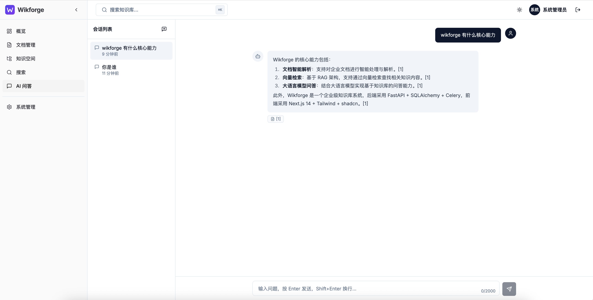
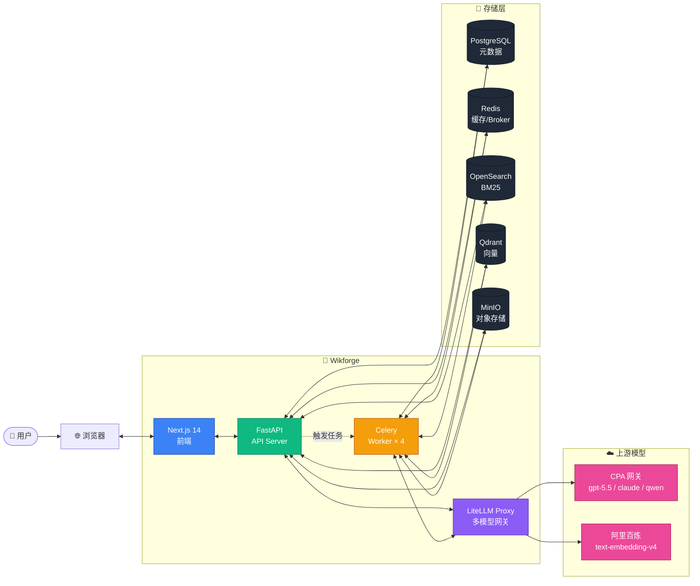
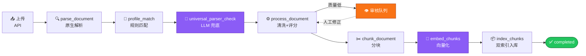
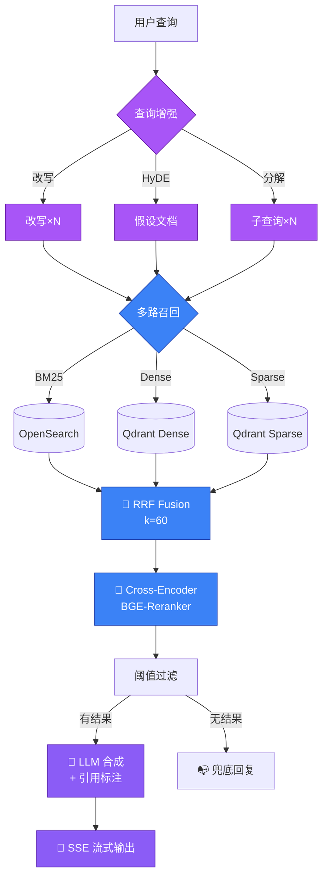

<div align="center">


<br/>

<p>
  <a href="#-quick-start"></a>
  <a href="docs/deploy.md"></a>
  <a href="#-roadmap"></a>
</p>

<p>
  
  
  
  
  
  
</p>

<p>
  
  
  
  
  
  
</p>

<p>
  <strong>企业级 RAG 知识库 · 文档解析 · 智能检索 · 流式问答 · 反馈闭环</strong>
</p>

</div>

<br/>

## ✨ 核心能力

```
📄 文档解析           插件式架构: PDF / DOCX / Markdown / HTML / 源代码 + LLM 视觉兜底
🔍 复合搜索           BM25 + Dense Vector + Sparse Vector + RRF 融合 + Cross-Encoder 重排
🎯 Profile 系统       自动匹配文档类型 (通用文本 / 中式技术规范 / 扫描版 PDF)
💡 查询增强           LLM 改写 / HyDE 假设文档 / 多子查询分解, 三档独立开关
🤖 流式 RAG           SSE 输出 + 引用标注 + 会话记忆, 首 token < 5s
🔁 反馈闭环           错误模式聚合 → 优化建议 → 一键应用 → 批量重处理
📚 领域词典           术语标准化 + 同义词扩展 + 候选词审核
🔐 权限隔离           Pre-Filtering 在向量层与全文层同时生效, 50ms 内完成判定
🛡️ 审核队列           解析质量评分 + 人工修正 + Profile 反向优化
📊 后台管理           空间 / 用户 / 权限 / Profile / 词典 / 反馈 / 监控 / LLM 网关
```

## 📸 产品截图

<table>
  <tr>
    <td width="50%">
      
      <p align="center"><sub><b>落地页</b> · 紫色品牌色 + 三入口</sub></p>
    </td>
    <td width="50%">
      
      <p align="center"><sub><b>登录</b> · 邮箱密码 / OIDC 单点</sub></p>
    </td>
  </tr>
  <tr>
    <td width="50%">
      
      <p align="center"><sub><b>文档管理</b> · 多文件上传 + 实时进度 + 标签/移动/批量</sub></p>
    </td>
    <td width="50%">
      
      <p align="center"><sub><b>RAG 流式问答</b> · Markdown 渲染 + 引用标注 + 会话记忆</sub></p>
    </td>
  </tr>
  <tr>
    <td colspan="2">
      
      <p align="center"><sub><b>系统监控</b> · 文档队列状态 + CPU / 内存 / 磁盘实时</sub></p>
    </td>
  </tr>
</table>

## 🚀 Quick Start

```bash
# 1. 配置环境变量
cp .env.example .env
make secrets         # 生成强随机密钥, 拷贝到 .env
vim .env             # 至少填: CPA_API_KEY (Chat) / DASHSCOPE_API_KEY (Embedding)

# 2. 一键拉起 9 个服务
make first-run

# 3. 验证 (走一遍 登录→上传→搜索→RAG)
./scripts/smoke-test.sh

# 4. 访问
open http://localhost                # 前端 (admin@wikforge.com / Admin@123)
open http://localhost:8000/docs      # API 文档 (Swagger)
open http://localhost:4000/ui        # LiteLLM Admin
open http://localhost:9001           # MinIO Console
open http://localhost:6333/dashboard # Qdrant Dashboard
```

完整部署 / 升级 / 备份 / 排错请看 [`docs/deploy.md`](docs/deploy.md)。

## 🏗️ 架构



## 📥 文档处理管线



## 🔍 检索与问答管线



## 📦 技术栈

| 层 | 组件 | 版本 | 职责 |
|---|---|---|---|
| **API** | FastAPI | 0.115+ | 异步 HTTP / OpenAPI 文档 |
| **ORM** | SQLAlchemy | 2.0 (async) | 类型安全的 DB 访问 |
| **Worker** | Celery | 5.4 | 文档处理流水线 |
| **迁移** | Alembic | 1.13+ | 数据库版本管理 |
| **前端** | Next.js | 14 (App Router) | React Server Components |
| **样式** | Tailwind + shadcn/ui | 3.4 | 设计系统 |
| **状态** | Zustand | 5 | 轻量状态管理 |
| **数据库** | PostgreSQL | 16 | 主数据 + JSONB 配置 |
| **缓存** | Redis | 7 | Celery broker / 进度 / 会话 |
| **全文** | OpenSearch | 2.17 | BM25 + 中文分词 (IK 可选) |
| **向量** | Qdrant | 1.14 | Dense (1024d) + Sparse (TF-IDF) |
| **存储** | MinIO | 2025 | S3 兼容对象存储 |
| **LLM** | LiteLLM Proxy | latest | 100+ provider 统一网关 |

## 🧰 常用命令

```bash
make help            # 查看全部命令 (14 个)
make ps              # 服务状态
make logs            # 跟踪所有日志
make logs-api        # 只看 api
make logs-worker     # 只看 worker
make psql            # 进 PostgreSQL CLI
make shell-api       # 进 api 容器 bash
make migrate         # 手动跑 alembic upgrade head
make seed            # 手动 init_db (admin + 默认 Profile)
make verify          # 跑 verify_compose 完整健康检查
make secrets         # 生成一组强随机密钥
make first-run       # 新机器: 启动 + 等待 healthy + 提示访问
make down            # 停止 (保留 volume)
make reset           # 完全清理 (会丢数据!)
```

## 🗂️ 目录结构

```
wikforge/
├── backend/              # Python / FastAPI
│   ├── app/
│   │   ├── api/          # 路由层 (auth/documents/search/qa/admin_*)
│   │   ├── services/     # 业务逻辑
│   │   ├── tasks/        # Celery 任务 (pipeline.py 是核心)
│   │   ├── models/       # SQLAlchemy ORM
│   │   ├── core/         # 基础设施 (db/redis/qdrant/opensearch/minio)
│   │   └── scripts/      # init_db / api-entrypoint
│   ├── alembic/          # 数据库迁移
│   ├── tests/            # 单元 + 集成测试 (1981 个)
│   └── eval/             # 检索质量评估 (Recall@K / MRR / NDCG)
├── frontend/             # Next.js 14
│   ├── src/app/          # App Router 页面
│   ├── src/components/   # UI 组件
│   ├── src/lib/          # api-client / utils
│   └── src/stores/       # Zustand stores
├── litellm/config.yaml   # LiteLLM Proxy 模型路由配置
├── scripts/              # verify_compose / smoke-test / postgres-init
├── docs/                 # 部署文档 / 架构图 / 资源
└── docker-compose.yml    # 9 服务编排
```

## 🛣️ Roadmap

> 总计 55 项, 详情参见 [`docs/ROADMAP.md`](docs/ROADMAP.md)。

### 近期 (P1)

- [ ] **A1** `list_spaces` / `list_documents` 加权限过滤
- [ ] **B1** OpenSearch 装 IK 中文分词器 (中文召回 +30~50%)
- [ ] **B2** 真 Cross-Encoder reranker (BAAI/bge-reranker-base)
- [ ] **B4-B5** Profile 自动匹配 / LLM 兜底实测

### 中期 (P2)

- [ ] **A4** Embedding 走 LiteLLM Proxy 统一管控
- [ ] **A5** LiteLLM Redis 缓存验证
- [ ] **A6** UploadService commit 边界重构
- [ ] **C1** 文档下载用 presigned URL
- [ ] **C2** 大文件 multipart 上传
- [ ] **C6** 升级到 query_points API, 解锁 qdrant-client 1.15+

### 远期 (P3)

- [ ] **D2-D3** 备份 cron + nginx 反代 (TLS / SSE)
- [ ] **E1-E12** 用户体验扩展 (改密 / 版本管理 / 审计 / 批量操作 / i18n / 移动端)
- [ ] **F1-F7** 性能 / HA (gunicorn / Redis Sentinel / Qdrant HNSW 调优)
- [ ] **G1-G5** CI/CD 集成测试 / 检索质量自动评估

## 📚 文档

| 文档 | 说明 |
|---|---|
| [`docs/deploy.md`](docs/deploy.md) | 部署 / 升级 / 备份 / 排错完整手册 |
| [`docs/ROADMAP.md`](docs/ROADMAP.md) | 55 项修复 / 优化清单 |
| [`backend/tests/integration/README.md`](backend/tests/integration/README.md) | 集成测试运行说明 |
| [`frontend/e2e/README.md`](frontend/e2e/README.md) | Playwright E2E 说明 |
| [`scripts/README.md`](scripts/README.md) | 运维脚本说明 |

## 🔐 安全

私有仓库, 内网部署。

- ✅ `.env` 在 `.gitignore` 第 1 行, 凭证不入库
- ✅ JWT 签发 / 轮换 / 失败次数锁定
- ✅ Permission Pre-Filtering 在向量库 + 全文库 + Cache 三层一致
- ✅ Profile / 解析失败队列 + 重试上限 + 审核闭环
- ⚠️ 默认 admin 密码 `Admin@123`, **首次登录立即修改**
- ⚠️ Master Key / Secret Key 占位符为 `change-me-*`, 部署前必须替换
- ❌ 当前无 HTTPS 终止, 部署到公网前请加反向代理

## 📜 License

私有项目, All rights reserved by Jolc.

---

<div align="center">

由 ❤️ 与 ☕ 在 macOS 上锻造

<sub>Wiki + Forge — 锻造企业知识库</sub>

</div>
